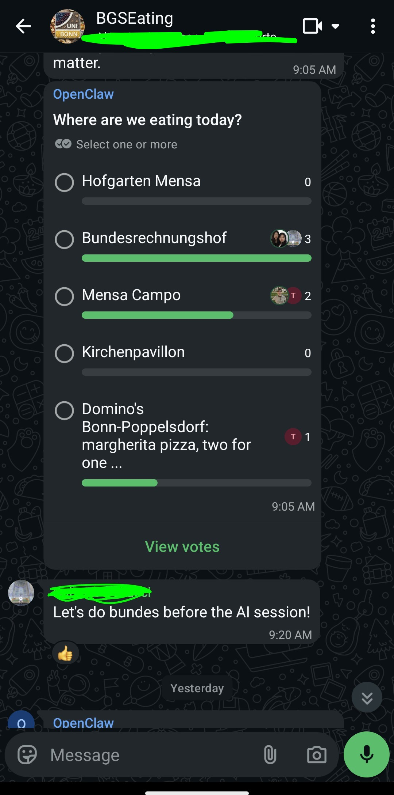
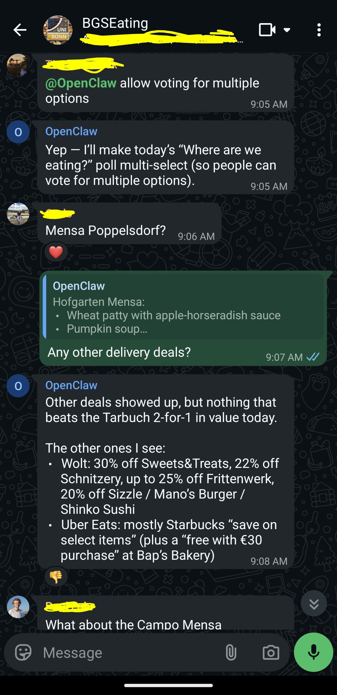

# LunchBot

It's lunchtime, but you and your colleagues cannot agree on where to eat? People are comparing and arguing over the daily menus from five different canteens? Been there.

My OpenClaw LunchBot solves this problem. It scrapes the daily options around my PhD office as well as delivery APIs, compacts them into a small feed, and sends a WhatsApp summary plus a lunch poll.

<p align="center">
  
  
</p>

## What it does

- Scrapes canteen menus from Bundesrechnungshof, Hofgarten Mensa, Mensa Campo, and Kirchenpavillon.
- Scrapes delivery deals from Wolt and Uber Eats, including two-for-one style offers.
- Stores scraper output as feather caches and as a compact markdown feed.
- Sends a concise WhatsApp lunch summary and a poll with all options.

## Architecture

There are two scheduled jobs. The first is a normal OS cron job that runs at 10:50 on weekdays. It refreshes all caches and writes the compact feed to a shared file.

```text
10:50 Europe/Berlin
cron -> ops/lunchbot_refresh_cache.sh -> pixi run scrape -> pixi run lunch-feed-cache-compact -> raw_feed.md
```

The second job is an OpenClaw cron job that runs at 11:00 on weekdays. It reads the cached feed, formats the lunch options in English, sends a WhatsApp group summary, and then sends a poll.

```text
11:00 Europe/Berlin
OpenClaw cron -> read raw_feed.md -> summarize -> WhatsApp text + poll
```

The real WhatsApp group ID and local runtime paths are redacted in the ops examples.

## Scrapers

- `src/bundesrechnungshof/client.py`: downloads the current weekly PDF menu and extracts the table with PyMuPDF.
- `src/hofgarten/client.py`: calls the Studierendenwerk Bonn AJAX endpoint and parses the HTML menu.
- `src/campo/client.py`: reuses the Hofgarten parser for the Mensa Campo canteen ID.
- `src/kirchenpavillon/client.py`: parses the Kirchenpavillon WordPress menu and keeps the previous dish because it is often sold at a discount.
- `src/wolt/client.py`: uses Wolt public web APIs to collect restaurants, discounts, item names, and effective prices.
- `src/ubereats/client.py`: uses Camoufox and Playwright to load Uber Eats pages, read embedded SSR/React Query state, and extract item-level deals.

## Project Structure

```text
.
|-- config.toml                 # Bonn location used by delivery scrapers
|-- ops/                        # Sanitized cron and OpenClaw job examples
|-- screenshots/                # WhatsApp output screenshots
|-- src/
|   |-- main.py                 # Parallel scraper orchestration
|   |-- lunch_feed.py           # Compact markdown feed for OpenClaw
|   |-- cache.py                # Shared feather cache
|   |-- bundesrechnungshof/     # PDF menu scraper
|   |-- hofgarten/              # Studierendenwerk parser
|   |-- campo/                  # Mensa Campo wrapper
|   |-- kirchenpavillon/        # Kirchenpavillon parser
|   |-- wolt/                   # Wolt deal scraper
|   `-- ubereats/               # Uber Eats deal scraper
`-- tests/                      # Parser, cache, feed, and scraper tests
```

## Running locally

This is part of an OpenClaw setup. You can run the scrapers locally with pixi:

```bash
pixi install
```

Refresh all scraper caches:

```bash
pixi run scrape
```

Print the compact feed that OpenClaw reads:

```bash
pixi run lunch-feed-cache-compact
```

Run tests:

```bash
pixi run pytest
```
